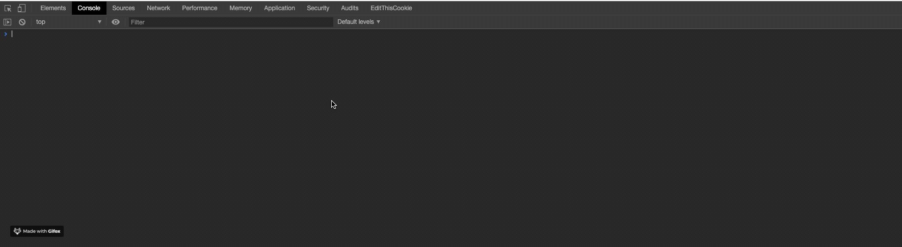

# bypass-cors 
>a proxy server to bypass CORS (Cross-Origin Resource Sharing) enabled servers

Proxy your requests just by prefixing your request URL with: `https://non-cors.herokuapp.com/` with all the headers and payload as it is.

### _CORS_ ?
Browsers enforce same origin policy (CORS) to protect the users from XSS (Cross Site Scripting) among several other types of attacks.

In short, browsers blocks all the requests which are not originated from the same origin as that of the web-page.

But this feature banes the developer from accessing data from different servers. Luckily, there's a way out of this, and that's what `bypass-cors` uses.

### How does `bypass-cors` proxy _CORS_ ? 
Whenever we make a cross origin request, browsers set a request header called `Origin`, to give the information about the requester, and uses the `CORS policy` to block the non-origin requests.
And checks the Response Header for `Access-Control` header values according to `CORS policy`. 

Hence, if we can change the response headers in our favor than we can easily tricks the browser, and this is what the `bypass-cors proxy server` does.

It acts as a middleware and make request to the destined server, obtain response, and adds/sets some relevant headers with the response and sends it back to you, tricking the browser.

### Examples
Proxy your requests just by prefixing your request URL with: `https://non-cors.herokuapp.com/` with all the headers and payload as it is. 
**bypass-cors** supports all types of `http.Method` requests.
    
> [`https://non-cors.herokuapp.com/<Your-URL>`](https://non-cors.herokuapp.com/<Your-URL>) + Request Header & Body (if any)

```http request
GET https://joke-api-strict-cors.appspot.com/jokes/ten    ==>    GET https://non-cors.herokuapp.com/https://joke-api-strict-cors.appspot.com/jokes/ten
``` 

### Request for Contribution
Changes and improvements are more than welcome! 

Feel free to fork, create issues or pull a request [here.](https://github.com/Shivam010/bypass-cors/issues)

Please make your changes in a specific branch and request to pull into master! If you can please make sure that the changes work properly and does not affect the functioning of the website before sending a Pull Request, as that will help speed up the process.

### License
The application, its design and its code all are licensed under the [MIT license.](https://github.com/Shivam010/bypass-cors/blob/master/LICENSE)
 
